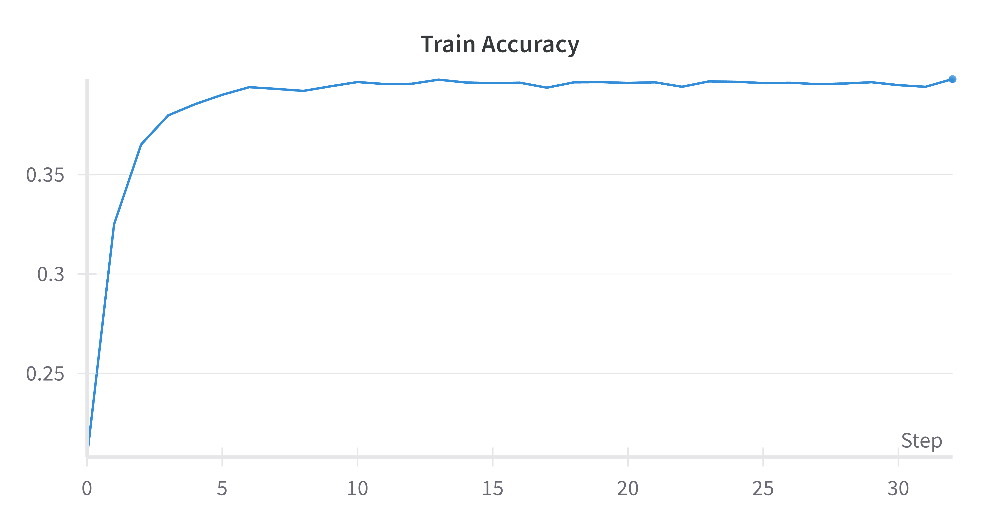
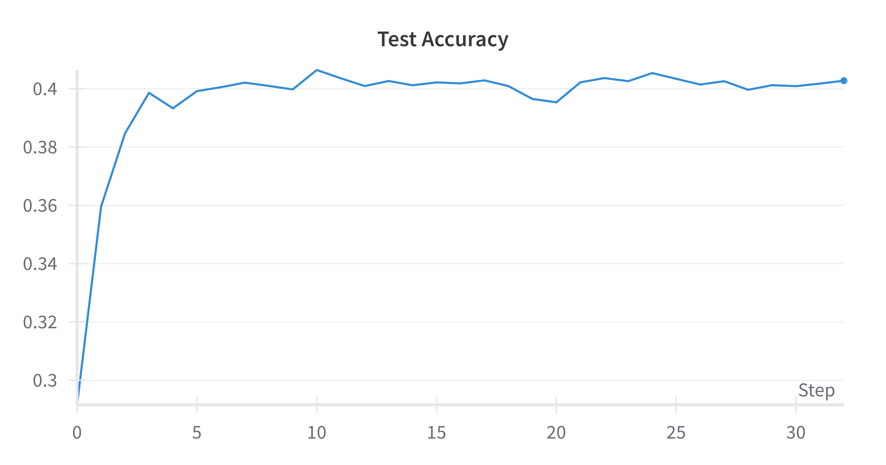

# Hebbian Descent
PyTorch implementation of the views presented in <a href="https://direct.mit.edu/neco/article/36/9/1669/124060/Hebbian-Descent-A-Unified-View-on-Log-Likelihood">Hebbian Descent: A Unified View on Log-Likelihood Learning</a> to overcome the saturation of final layer activations by modifying the update rule using Hebbian descent. 

## Models Tested
- Single Layer Neural Network
- Multi layer Neural Network(2 hidden layers consisting of 200 hidden units each and 1 output layer)

## Training Curves



## Citation

```
@article{10.1162/neco_a_01684,
    author = {Melchior, Jan and Schiewer, Robin and Wiskott, Laurenz},
    title = "{Hebbian Descent: A Unified View on Log-Likelihood Learning}",
    journal = {Neural Computation},
    volume = {36},
    number = {9},
    pages = {1669-1712},
    year = {2024},
    month = {08},
    abstract = "{This study discusses the negative impact of the derivative of the activation functions in the output layer of artificial neural networks, in particular in continual learning. We propose Hebbian descent as a theoretical framework to overcome this limitation, which is implemented through an alternative loss function for gradient descent we refer to as Hebbian descent loss. This loss is effectively the generalized log-likelihood loss and corresponds to an alternative weight update rule for the output layer wherein the derivative of the activation function is disregarded. We show how this update avoids vanishing error signals during backpropagation in saturated regions of the activation functions, which is particularly helpful in training shallow neural networks and deep neural networks where saturating activation functions are only used in the output layer. In combination with centering, Hebbian descent leads to better continual learning capabilities. It provides a unifying perspective on Hebbian learning, gradient descent, and generalized linear models, for all of which we discuss the advantages and disadvantages. Given activation functions with strictly positive derivative (as often the case in practice), Hebbian descent inherits the convergence properties of regular gradient descent. While established pairings of loss and output layer activation function (e.g., mean squared error with linear or cross-entropy with sigmoid/softmax) are subsumed by Hebbian descent, we provide general insights for designing arbitrary loss activation function combinations that benefit from Hebbian descent. For shallow networks, we show that Hebbian descent outperforms Hebbian learning, has a performance similar to regular gradient descent, and has a much better performance than all other tested update rules in continual learning. In combination with centering, Hebbian descent implements a forgetting mechanism that prevents catastrophic interference notably better than the other tested update rules. When training deep neural networks, our experimental results suggest that Hebbian descent has better or similar performance as gradient descent.}",
    issn = {0899-7667},
    doi = {10.1162/neco_a_01684},
    url = {https://doi.org/10.1162/neco\_a\_01684},
    eprint = {https://direct.mit.edu/neco/article-pdf/36/9/1669/2465982/neco\_a\_01684.pdf},
}
```
